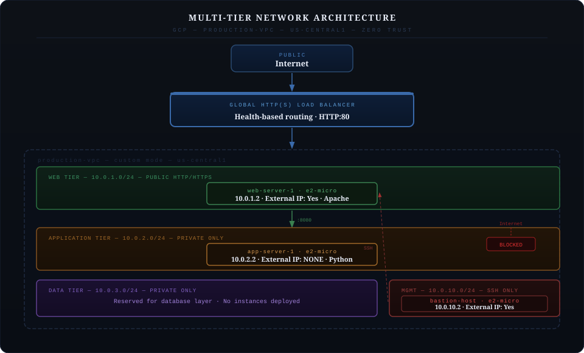

# GCP Multi-Tier Network Architecture

Production-grade multi-tier network architecture on Google Cloud Platform demonstrating enterprise network segmentation, zero trust security design, and infrastructure deployment via the gcloud CLI.

---

## Project Overview

This project implements a four-tier VPC network on GCP with strict traffic isolation between layers. The web tier is publicly accessible via a global load balancer, the application tier has no external IP and is reachable only from within the VPC, and all SSH access is funnelled through a single bastion host in the management subnet. The data tier subnet is reserved for a future database layer.

---

## Architecture Diagram



---

## Components

| Component | Details |
|-----------|---------|
| **VPC** | production-vpc, custom mode, us-central1 |
| **Subnets** | 4 tiers: web, app, data, management |
| **Instances** | 3 VMs: bastion-host, web-server-1, app-server-1 |
| **Load Balancer** | Global HTTP(S) LB with health checks |
| **Firewall Rules** | 5 least-privilege rules |

---

## Network Design

### Subnet Layout

| Tier | CIDR | Access |
|------|------|--------|
| Management | 10.0.10.0/24 | SSH from authorized IP only |
| Web | 10.0.1.0/24 | Public HTTP/HTTPS |
| Application | 10.0.2.0/24 | Private only (no external IP) |
| Data | 10.0.3.0/24 | Private only (reserved) |

### Compute Resources

| Instance | Machine Type | Internal IP | External IP | Role |
|----------|-------------|-------------|-------------|------|
| bastion-host | e2-micro | 10.0.10.2 | Yes | SSH gateway |
| web-server-1 | e2-micro | 10.0.1.2 | Yes | Apache web server |
| app-server-1 | e2-micro | 10.0.2.2 | None | Python application server |

**Total:** 6 vCPUs, 3GB RAM

---

## Security Model

The architecture follows zero trust principles with strict network segmentation.

The application tier has no external IP address and is completely unreachable from the internet. All SSH access into the environment routes through the bastion host in the management subnet, which is restricted to a single authorized source IP. Firewall rules are scoped to the minimum required ports and source ranges for each tier, with no rules broader than necessary.

### Firewall Rules

| Rule | Direction | Source | Target | Ports |
|------|-----------|--------|--------|-------|
| allow-ssh-bastion | Ingress | Your IP | management-tier | TCP:22 |
| allow-http-web | Ingress | 0.0.0.0/0 | web-tier | TCP:80, 443 |
| allow-health-checks | Ingress | 35.191.0.0/16, 130.211.0.0/22 | web-tier | TCP:80 |
| allow-web-to-app | Ingress | 10.0.1.0/24 | app-tier | TCP:8080 |
| allow-bastion-ssh | Ingress | 10.0.10.0/24 | web-tier, app-tier | TCP:22 |

---

## Implementation

### 1. VPC and Subnets

```bash
# Create VPC
gcloud compute networks create production-vpc --subnet-mode=custom

# Create subnets
gcloud compute networks subnets create web-tier \
    --network=production-vpc \
    --region=us-central1 \
    --range=10.0.1.0/24

gcloud compute networks subnets create app-tier \
    --network=production-vpc \
    --region=us-central1 \
    --range=10.0.2.0/24

gcloud compute networks subnets create data-tier \
    --network=production-vpc \
    --region=us-central1 \
    --range=10.0.3.0/24

gcloud compute networks subnets create management-tier \
    --network=production-vpc \
    --region=us-central1 \
    --range=10.0.10.0/24
```

### 2. Compute Instances

```bash
# Bastion host (management tier, external IP for SSH entry)
gcloud compute instances create bastion-host \
    --zone=us-central1-a \
    --machine-type=e2-micro \
    --subnet=management-tier \
    --tags=bastion

# Web server (web tier, external IP for public traffic)
gcloud compute instances create web-server-1 \
    --zone=us-central1-a \
    --machine-type=e2-micro \
    --subnet=web-tier \
    --tags=web-server

# App server (app tier, NO external IP)
gcloud compute instances create app-server-1 \
    --zone=us-central1-a \
    --machine-type=e2-micro \
    --subnet=app-tier \
    --no-address \
    --tags=app-server
```

### 3. Firewall Rules

```bash
# SSH to bastion from authorized IP only
gcloud compute firewall-rules create allow-ssh-bastion \
    --network=production-vpc \
    --action=ALLOW \
    --rules=tcp:22 \
    --source-ranges=YOUR_IP/32 \
    --target-tags=bastion

# HTTP/HTTPS to web tier from internet
gcloud compute firewall-rules create allow-http-web \
    --network=production-vpc \
    --action=ALLOW \
    --rules=tcp:80,tcp:443 \
    --source-ranges=0.0.0.0/0 \
    --target-tags=web-server

# Health check traffic from GCP ranges
gcloud compute firewall-rules create allow-health-checks \
    --network=production-vpc \
    --action=ALLOW \
    --rules=tcp:80 \
    --source-ranges=35.191.0.0/16,130.211.0.0/22 \
    --target-tags=web-server

# Web tier to app tier on port 8080
gcloud compute firewall-rules create allow-web-to-app \
    --network=production-vpc \
    --action=ALLOW \
    --rules=tcp:8080 \
    --source-ranges=10.0.1.0/24 \
    --target-tags=app-server

# Bastion SSH to all internal tiers
gcloud compute firewall-rules create allow-bastion-ssh \
    --network=production-vpc \
    --action=ALLOW \
    --rules=tcp:22 \
    --source-ranges=10.0.10.0/24 \
    --target-tags=web-server,app-server
```

### 4. Global Load Balancer

```bash
# Health check
gcloud compute health-checks create http http-basic-check \
    --port=80

# Backend service
gcloud compute backend-services create web-backend \
    --protocol=HTTP \
    --health-checks=http-basic-check \
    --global

# Add web instance as backend
gcloud compute backend-services add-backend web-backend \
    --instance-group=web-server-1 \
    --instance-group-zone=us-central1-a \
    --global

# URL map and proxy
gcloud compute url-maps create web-map \
    --default-service=web-backend

gcloud compute target-http-proxies create web-proxy \
    --url-map=web-map

gcloud compute forwarding-rules create web-rule \
    --global \
    --target-http-proxy=web-proxy \
    --ports=80
```

---

## Connectivity Testing

| Test | Result |
|------|--------|
| Internet to web server (HTTP) | PASS |
| Internet to load balancer | PASS |
| Bastion SSH to web-server-1 | PASS |
| Bastion SSH to app-server-1 | PASS |
| Web server to app server (8080) | PASS |
| Internet to app server (direct) | BLOCKED |

---

## Cost Analysis

| Component | Hourly | Daily |
|-----------|--------|-------|
| 3x e2-micro instances | $0.03 | $0.72 |
| Global Load Balancer | $0.025 | $0.60 |
| **Total** | **$0.055** | **$1.32** |

Estimated lab cost for a 3-4 hour session: under $0.50.

---

## Skills Demonstrated

This project covers VPC design and custom subnet segmentation, zero trust network architecture with bastion-host access patterns, least-privilege firewall rule design, global load balancer configuration, and multi-tier instance deployment using the gcloud CLI. It also demonstrates the practical separation of public-facing, application, and data layers in a cloud-native environment.

---

## Certification Relevance

Competencies demonstrated are relevant to the Google Cloud Associate Cloud Engineer, Professional Cloud Architect, and Professional Network Engineer certifications.

---

## Author

**Gregory B. Horne**
Cloud Solutions Architect

[GitHub: gbhorne](https://github.com/gbhorne) | [LinkedIn](https://linkedin.com/in/gbhorne)

---

## License

MIT License - See LICENSE file for details
